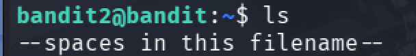

# Bandit

## Setting

bandit을 풀기 위해서는 SSH로 접근해야 한다.

```
host : bandit.labs.overthewire.org
port : 2220
```

위 정보는 Bandit 페이지에서 좌측 상단에서 확인할 수 있다.
각 단계에 접속하기 위해서는
`ssh bandit<level>@bandit.labs.overthewire.org -p 2220`
을 입력한 뒤, 각 단계의 플래그로 제시되는 비밀번호를 입력하면 다음 단계로 진입할 수 있다.

---

## Level 0 ~ 10

1. level 0 -> 1 <br/>
   level0의 계정에 접속한 뒤 `ls`를 통해 어떤 파일이 있는지 확인해본다.
   표시되는 `readme` 파일을 `cat`을 통해 읽어주면 비밀번호를 확인할 수 있다.
   

1. level 1 -> 2 <br/>
   level1의 계정에 접속할 때는, 앞서 로그인한 level0에서 로그아웃 한 뒤 다시 ssh 로그인을 통해 다음 단계로 이동하면 된다.
   
   이번에는 권한까지 표시될 수 있도록 `ls -alh`를 통해 파일 목록을 확인해보았다.<br/>
   `-` 라는 파일이 있으나, 아까와 같이 `cat` 명령어를 사용해 읽으려고 하면 입력 대기 상태에 진입한다.<br/>
   `-`를 CLI가 파일 이름으로 인식하도록 하기 위해 `""`도 붙여 보았으나 같은 결과를 도출한다.<br/>
   그 까닭은 `-`는 일반적으로 명령어의 옵션이나 인자로 사용되기 때문이다. 이를 해결하기 위한 방법은 디렉토리부터 경로를 작성해주면 된다.
   

1. level 2 -> 3 <br/>
   level2의 계정에 접속해서 파일 목록을 확인해보면 다음과 같은 파일이 나온다.
   
   level1에서와 마찬가지로 `-`로 시작하는 파일명이니 파일 경로를 작성해주거나, 앞에 `--`를 붙여주어야 한다.<br/>
   하지만 파일명에서 확인할 수 있듯, 해당 파일명에는 공백 문자가 포함되어있으므로 `""`로 묶어주어야 한다.
   

1. level 3 -> 4
   level3의 계정에 접속해보니 `inhere`이라는 디렉토리가 하나 나온다.
   해당 디렉토리로 이동해 `ls`를 사용해보면 아무 파일도 보이지 않는다.
   숨김파일까지 확인하기 위해 `-a` 옵션을 포함해 다시 확인해보면, 플래그가 담긴 숨김 파일을 확인할 수 있다.
   

1. level 4 -> 5
   
   이번 레벨에서는 -file00~09의 10개 파일을 발견했다.
   첫 번째 파일을 읽어보니 `사람이 읽을 수 없는` 형식의 내용이 등장하여 파일 유형을 확인해보니, `data` 유형이라고 한다.
   `OverTheWire`에서 이번 레벨의 Goal을 확인해보니,

```txt
The password for the next level is stored in the only human-readable file in the inhere directory. Tip: if your terminal is messed up, try the “reset” command.
```

다음 레벨의 비밀번호는 `human-readable` 파일에서 확인할 수 있다고 하니, 모든 파일의 유형을 확인해보았다.

`-file07`의 형식이 `ASCII text`로 사람이 읽을 수 있는 형식인 것을 확인했다. 해당 파일을 읽어보면 비밀번호를 확인할 수 있다.

