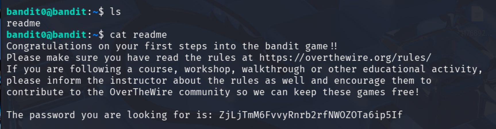
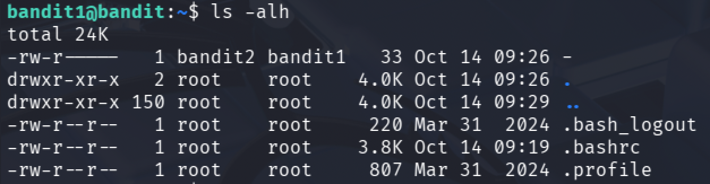
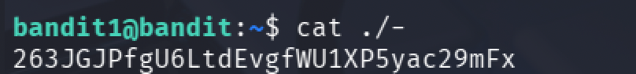

# Bandit

## Setting

bandit을 풀기 위해서는 SSH로 접근해야 한다.

```
host : bandit.labs.overthewire.org
port : 2220
```

위 정보는 Bandit 페이지에서 좌측 상단에서 확인할 수 있다.
각 단계에 접속하기 위해서는
`ssh bandit<level>@bandit.labs.overthewire.org -p 2220`
을 입력한 뒤, 각 단계의 플래그로 제시되는 비밀번호를 입력하면 다음 단계로 진입할 수 있다.

---

## Level 0 ~ 10

1. level 0 -> 1 <br/>
level0의 계정에 접속한 뒤 `ls`를 통해 어떤 파일이 있는지 확인해본다.
표시되는 `readme` 파일을 `cat`을 통해 읽어주면 비밀번호를 확인할 수 있다.


1. level 1 -> 2 <br/>
level1의 계정에 접속할 때는, 앞서 로그인한 level0에서 로그아웃 한 뒤 다시 ssh 로그인을 통해 다음 단계로 이동하면 된다.

이번에는 권한까지 표시될 수 있도록 `ls -alh`를 통해 파일 목록을 확인해보았다.<br/>
`-` 라는 파일이 있으나, 아까와 같이 `cat` 명령어를 사용해 읽으려고 하면 입력 대기 상태에 진입한다.<br/>
`-`를 CLI가 파일 이름으로 인식하도록 하기 위해 `""`도 붙여 보았으나 같은 결과를 도출한다.<br/>
그 까닭은 `-`는 일반적으로 명령어의 옵션이나 인자로 사용되기 때문이다. 이를 해결하기 위한 방법은 디렉토리부터 경로를 작성해주면 된다.



