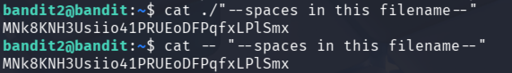
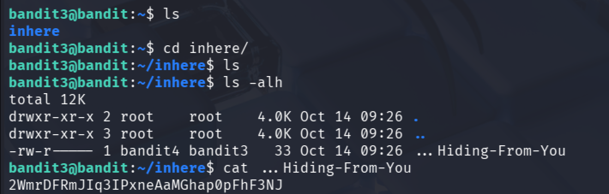
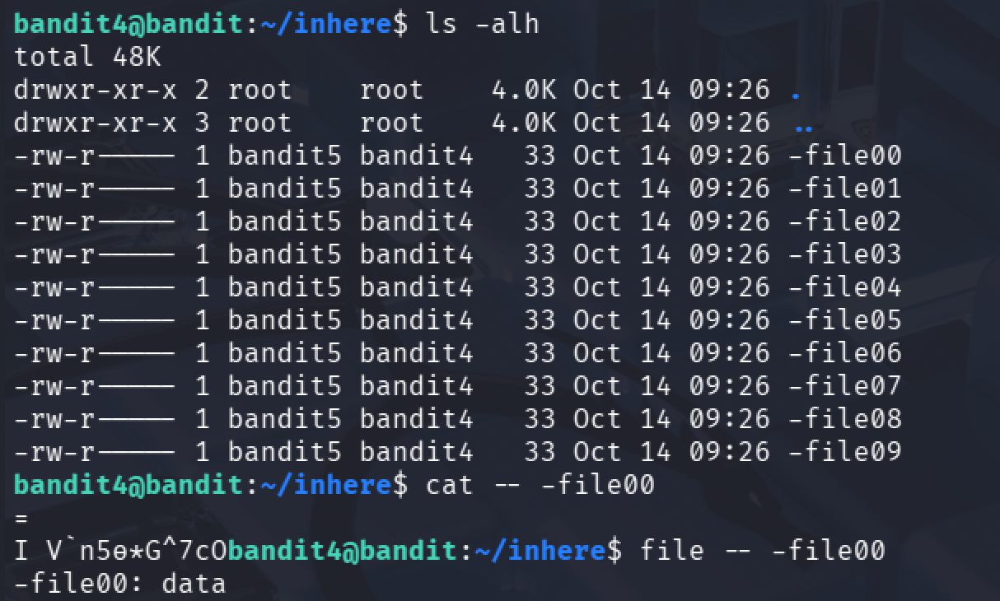
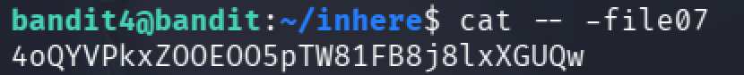
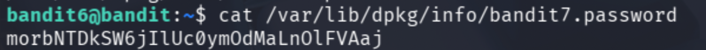
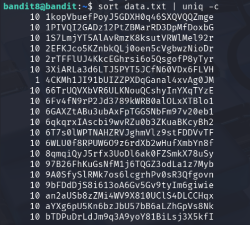
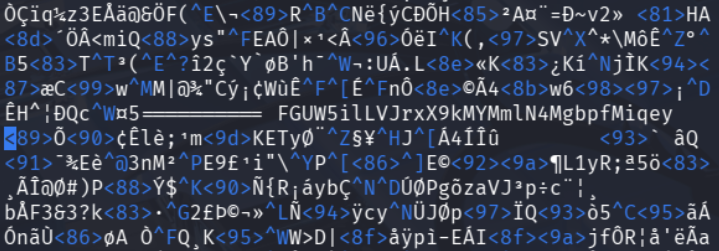
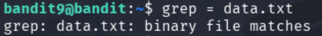
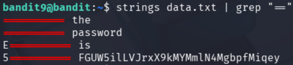
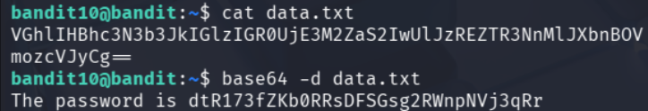

# Bandit 0~10

## Setting

bandit을 풀기 위해서는 SSH로 접근해야 한다.

```
host : bandit.labs.overthewire.org
port : 2220
```

위 정보는 Bandit 페이지에서 좌측 상단에서 확인할 수 있다.
각 단계에 접속하기 위해서는
`ssh bandit<level>@bandit.labs.overthewire.org -p 2220`
을 입력한 뒤, 각 단계의 플래그로 제시되는 패스워드를 입력하면 다음 단계로 진입할 수 있다.

---

## Level 0 ~ 10

1. level 0 -> 1 <br/>
   level0의 계정에 접속한 뒤 `ls`를 통해 어떤 파일이 있는지 확인해본다.
   표시되는 `readme` 파일을 `cat`을 통해 읽어주면 패스워드를 확인할 수 있다.
   
2. level 1 -> 2 <br/>
   level1의 계정에 접속할 때는, 앞서 로그인한 level0에서 로그아웃 한 뒤 다시 ssh 로그인을 통해 다음 단계로 이동하면 된다.
   
   이번에는 권한까지 표시될 수 있도록 `ls -alh`를 통해 파일 목록을 확인해보았다.<br/>
   `-` 라는 파일이 있으나, 아까와 같이 `cat` 명령어를 사용해 읽으려고 하면 입력 대기 상태에 진입한다.<br/>
   `-`를 CLI가 파일 이름으로 인식하도록 하기 위해 `""`도 붙여 보았으나 같은 결과를 도출한다.<br/>
   그 까닭은 `-`는 일반적으로 명령어의 옵션이나 인자로 사용되기 때문이다. 이를 해결하기 위한 방법은 디렉토리부터 경로를 작성해주면 된다.
   
3. level 2 -> 3 <br/>
   level2의 계정에 접속해서 파일 목록을 확인해보면 다음과 같은 파일이 나온다.
   
   level1에서와 마찬가지로 `-`로 시작하는 파일명이니 파일 경로를 작성해주거나, 앞에 `--`를 붙여주어야 한다.<br/>
   하지만 파일명에서 확인할 수 있듯, 해당 파일명에는 공백 문자가 포함되어있으므로 `""`로 묶어주어야 한다.
   
4. level 3 -> 4 <br/>
   level3의 계정에 접속해보니 `inhere`이라는 디렉토리가 하나 나온다.
   해당 디렉토리로 이동해 `ls`를 사용해보면 아무 파일도 보이지 않는다.
   숨김파일까지 확인하기 위해 `-a` 옵션을 포함해 다시 확인해보면, 플래그가 담긴 숨김 파일을 확인할 수 있다.
   
5. level 4 -> 5 <br/>
   
   이번 레벨에서는 -file00~09의 10개 파일을 발견했다.
   첫 번째 파일을 읽어보니 `사람이 읽을 수 없는` 형식의 내용이 등장하여 파일 유형을 확인해보니, `data` 유형이라고 한다.
   `OverTheWire`에서 이번 레벨의 Goal을 확인해보니,
```txt
The password for the next level is stored in the only human-readable file in the inhere directory. Tip: if your terminal is messed up, try the “reset” command.
```
다음 레벨의 패스워드는 `human-readable` 파일에서 확인할 수 있다고 하니, 모든 파일의 유형을 확인해보았다.

`-file07`의 형식이 `ASCII text`로 사람이 읽을 수 있는 형식인 것을 확인했다. 해당 파일을 읽어보면 패스워드를 확인할 수 있다.

6. level 5 -> 6 <br/>
   이전 레벨과 마찬가지로 `inhere` 디렉토리로 이동해보니, 이번에는 maybehere00~19의 20개 파일을 발견했다.<br/>
   첫 번째 디렉토리에 들어가보니 다시 9개의 파일을 발견할 수 있었다.
   
   문제 조건을 보니, 이번 레벨의 Goal은 `human-readable`, `1033 bytes in size`, `not executable`한 파일을 찾는 것이라고 한다.
   사이즈 정보가 특정되었으니 해당 정보를 이용해 찾아보자.<br/>
   다시 `inhere` 디렉토리로 돌아와서, `find` 명령어를 사용해 찾아준다.
   파일 유형에서 `very long lines`를 포함하고 있다고 하여 확인해보니, 패스워드 제외 전부 공백으로 채워져있었다.
   
7. level 6 -> 7 <br/>
   이번 레벨에서는 접속해보니 위에서와 달리 `ls -alh`를 해보았을 때 유의미한 파일이 표시되지 않았다.
   
   Level Goal을 확인해보니 다음과 같은 파일에 패스워드가 담겨 있다고 한다.
   - owned by user bandit7
   - owned by group bandit6
   - 33 bytes in size
  
   level5에서 사용했던 `find` 명령어에 옵션을 더 추가해 확인해보자.
   ```bash
   bandit6@bandit:~$ find / -user bandit7 -group bandit6 -size 33c
   ```
   와 같이 위의 조건들을 추가해 탐색을 해보았는데, 결과가 상당히 많이 나왔다.
   거의 모든 결과가 `Permission denied`로 표시되었다.
   가독성을 조금 더 향상시키기 위해 해당 에러문을 표시되지 않도록 해보자.
   `Permission denied`는 표준 에러에 해당하는 오류 메시지이므로, 이를 `/dev/null`로 리다이렉션 해준다.
   
   위와 같이 단 하나의 파일이 추려졌다.
   해당 파일을 읽어보면 다음 레벨의 패스워드를 확인할 수 있다.
   
8. level 7 -> 8 <br/>
   이번 레벨에서는 접속 후 `data.txt` 파일을 발견하였다.
   해당 파일을 `cat` 명령어를 통해 읽어보려 하였으나, 길이가 방대해 도중에 정지하였다. 파일의 내용은 영단어 옆에 패스워드 후보 문자열이 사전 형식으로 늘어져 있는 형태였다.
   Level Goal을 확인해보니 `millionth` 라는 단어 옆에 패스워드가 있다고 한다. `grep`을 사용해 패스워드를 찾도록 하자.
   
9. level 8 -> 9 <br/>
   이번 레벨은 얼핏 보기에 level7과 달라진 게 없어보인다.
   `data.txt`의 내용을 확인하기 위해 상위 10줄만 출력해보니 다음과 같았다.
   
   Level Goal을 확인하니, `한 번만 등장하는 라인`에 존재한다고 한다.<br/>
   패스워드를 찾기 위해서는 우선 중복되는 내용을 걸러내야 한다.
   중복을 찾아내기 위해 `uniq` 명령어를 사용해보자. 이때, `uniq`는 연속된 중복만 카운트할 수 있으므로 오름차순 정렬 작업이 추가적으로 필요하다.<br/>
   이를 위해 `sort` 명령어를 사용한다.<br/>
   두 명령어를 연결해주어야 하는데, 정렬된 텍스트를 대상으로 중복 검사를 해야 중복 횟수를 정확하게 알 수 있으므로 `sort data.txt | uniq -c`와 같이 명령어를 완성해준다.
   
   파일이 길어 보기가 조금 불편하니, 1번만 중복된, 즉 중복되지 않은 문자열을 `grep`으로 선별해 출력해보자.<br/>
   이때 탐색 대상을 `1`로 설정하면 패스워드에 있는 모든 1과 중복횟수 10까지 모두 찾게 되니, `"1 "`로 띄어쓰기를 포함하여 탐색해보자.
   
10. level 9 -> 10 <br/>   
   Level Goal
   ```txt
   The password for the next level is stored in the file data.txt in one of the few human-readable strings, preceded by several ‘=’ characters.
   ```
   이번 레벨에서는 접속해보니 이전처럼 `data.txt` 파일을 발견했고, 레벨 목표 또한 `몇 개의 '='` 기호 뒤의 `human-readable`한 문자열에 있다기에, 그냥 `vim editor`로 읽어서 풀었다. `==========` 를 발견하면 해당 기호 뒤에 문자열이 `the` `password` `is` `<password>`와 같은 식으로 적혀있었다.
    <br/>
   하지만 이게 출제자의 의도일리 없으니 다른 방법으로도 접근해보자.<br/>
   전에 풀었던 레벨처럼 `grep`을 사용하려니, 바이너리 파일은 읽을 수 없었다.
   
   따라서 바이너리 파일을 읽기 위해 `strings`를 사용해 텍스트를 우선적으로 찾아주었다. 물론 이 상태에서도 텍스트를 쭉 읽어보면 패스워드를 찾을 수 있겠지만, `grep`을 사용해 더 깔끔하게 정렬해보자.
   
11. level 10 -> 11
   이번 레벨의 목표는 `base64`로 인코딩된 패스워드를 얻어내면 된다.
   `cat`을 통해 `data.txt`를 읽어보니 길지 않은 길이의 인코딩된 텍스트가 출력되어, `base64 -d`를 통해 디코딩해주었다.
   